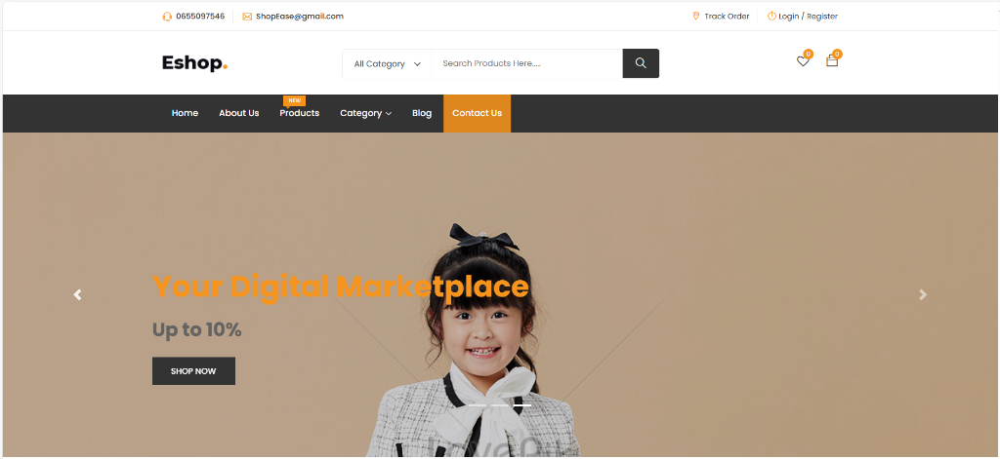
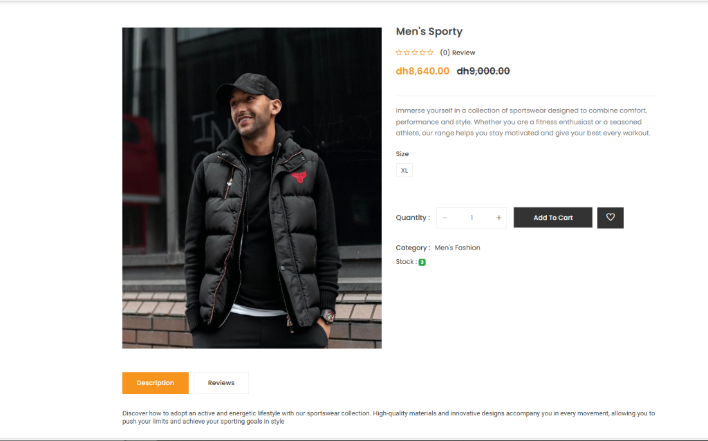
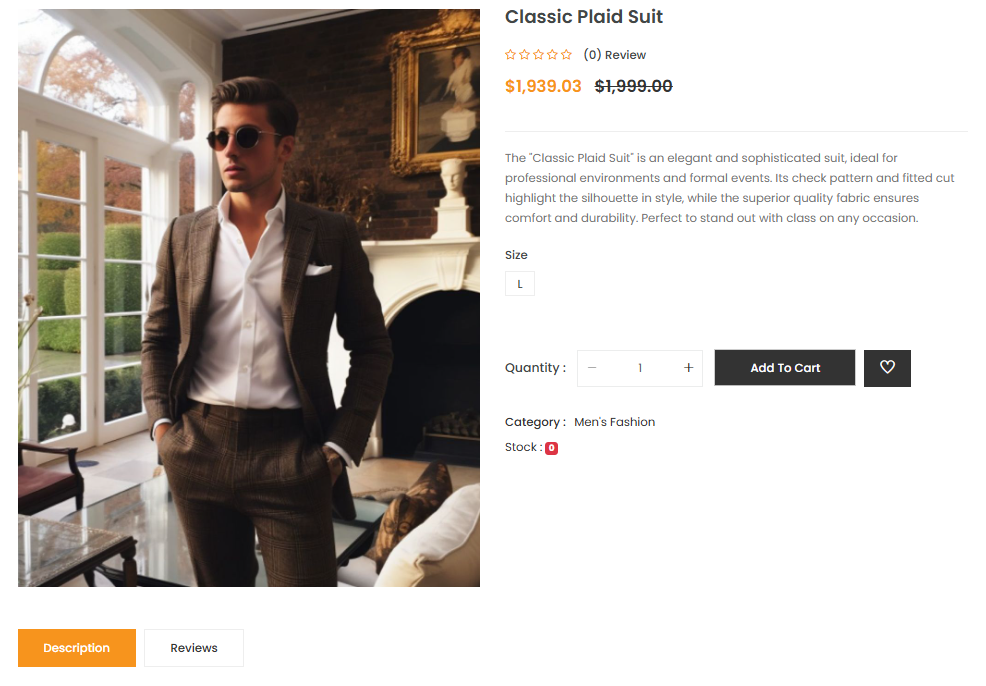
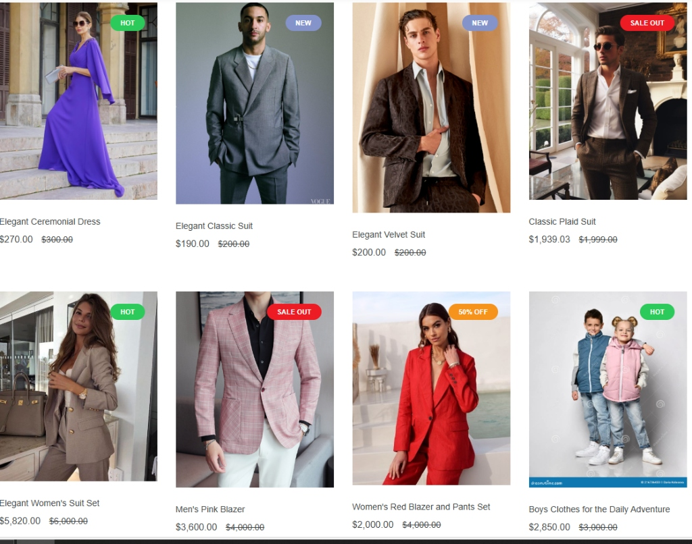
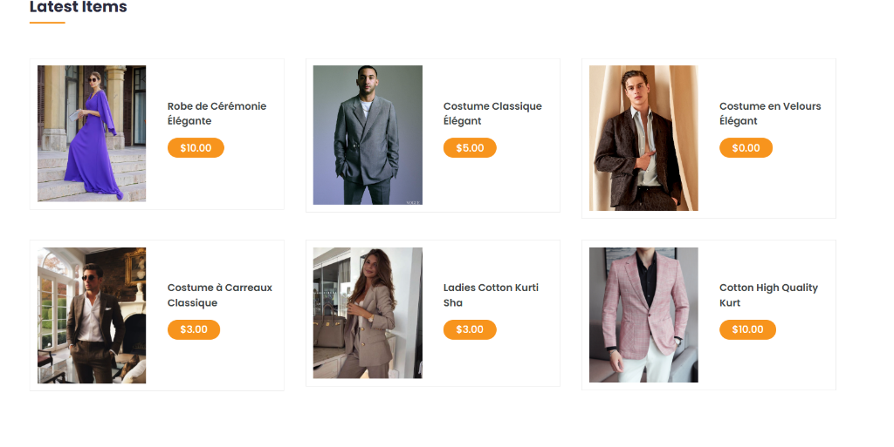
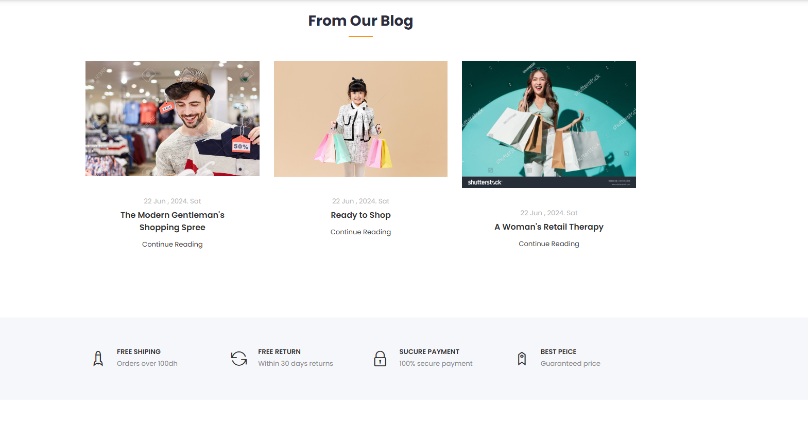
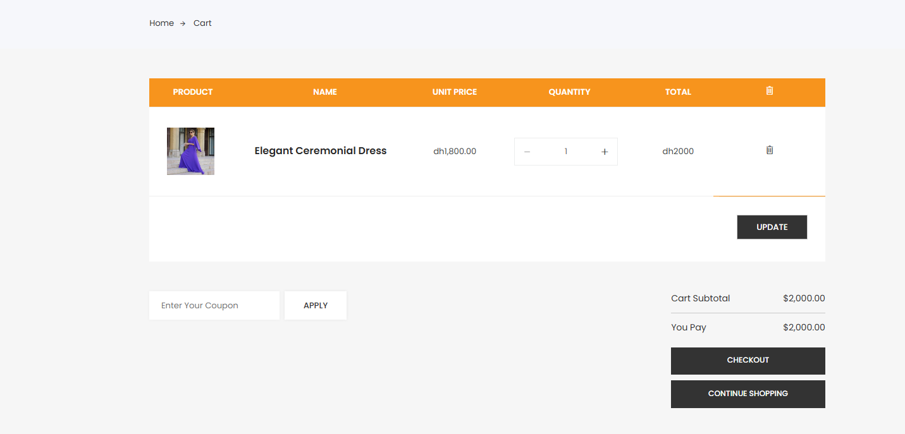
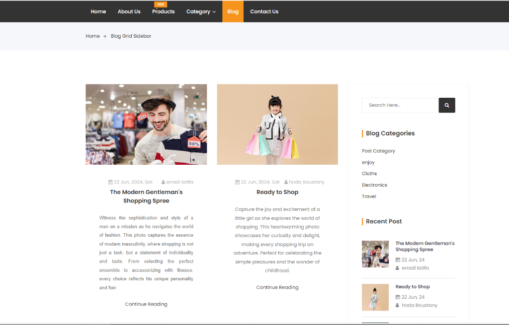
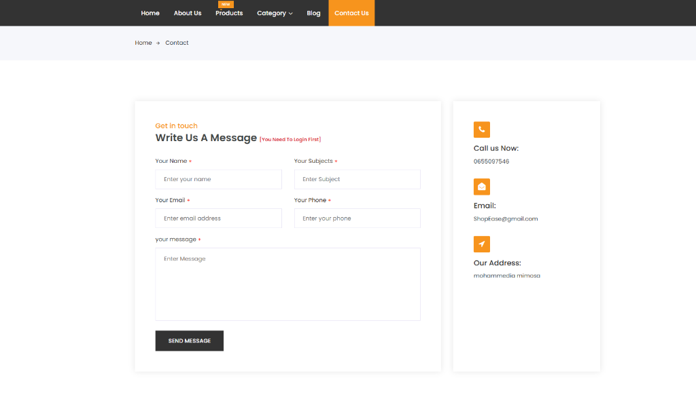
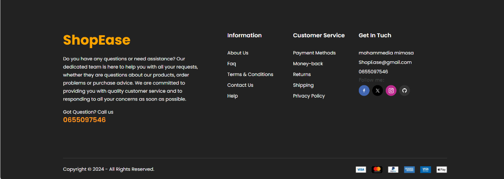

# Complete E-commerce website in Laravel 10

# ====== FRONT-END =======

- Responsive Layout
- Shopping Cart, Wishlist, Product Reviews
- Coupons & Discounts
- Product attributes: cost price, promotion price, stock, size...
- Blog: category, tag, content, web page 
- Module/Extension: Shipping, payment, discount, ...
- Upload manager: banner, images,..
- SEO support: customer URL b
- Newsletter management
- Contact forms with the real-time notification (Laravel Pusher)
- Related Products, Recommendations for you in our categories
- A Product search form
- Laravel Socialite implement (Facebook, Google & twitter) & Customer login
- Product Share and follow from different social platform...
- Payment integration (Paypal)
- Order Tracking system
- Multi-level comment system
many more......

## ======= ADMIN =======

- Admin roles, permission
- Product manager
- Media manager using unisharp laravel file manager
- Banner manager
- Order management
- Category management
- Brand management
- Shipping Management
- Review Management
- Blog, Category & Tag manager
- User Management
- Coupon Management
- System config: email setting, info shop, maintain status,...
- Line Chart & Pie chart ...
- Generate order in pdf form...
- Real time message & notification
- Profile Settings
Many more....

## ======= USER DASHBOARD =======

- Order management
- Review Management
- Comment Management
- Profile Settings

### Set up :

1.  Clone the repo and cd into it
2.  In your terminal ```composer install```
3.  Rename or copy ```.env.example``` file to ```.env```
4.  ```php artisan key:generate```
5.  Set your database credentials in your ```.env``` file
6.  Set your Braintree credentials in your ```.env``` file if you want to use PayPal
7.  Import db file (```database/e-shop.sql```) into your database
8.  ```npm install```
9.  ```npm run watch```
10. Run command [laravel file manager]:- ```php artisan storage:link```
11. Edit ```.env``` file :- remove APP_URL
12. ```php artisan serve``` or use virtual host
13. Visit ```localhost:8000``` in your browser

---

### Screenshots :

#### Home Page


#### Shop & Products








#### Blog Section



#### Contact Us



#### User Dashboard / Admin


#### Footer


---

<p style="text-align:center">Thank You so much for your time !!!</p>